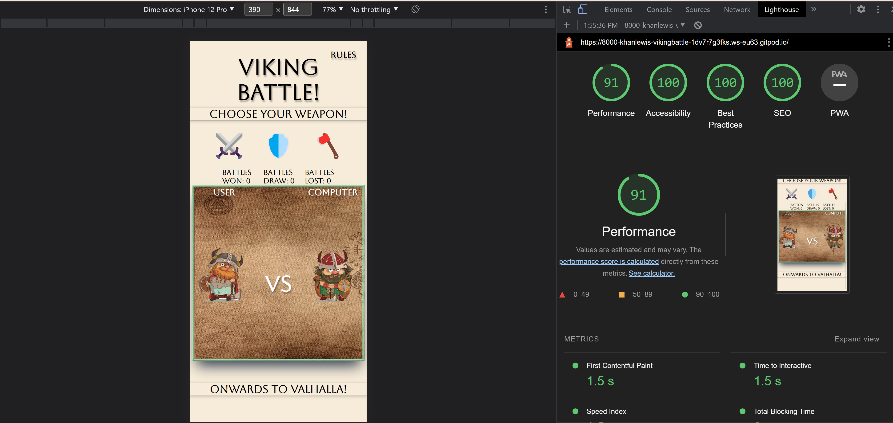

# **VIKING BATTLE !**

## **Introduction:**

Viking battle, is a luck-based game where the user can select a choice of three weapons, sword
shield or a battles axe. Each weapon has the chance to win or lose against the other weapons. For example, sword beats axe and shield beats sword. The purpose of this game is to give the user a quick and enjoyable experience in the unexpected reality off battling Vikings! The aim of the game is to defeat as many Vikings as possible without losing to many battles. But battles lost isnt considered a truly terrible thing to happen, according to mythology a Viking that lost in battle , their souls would be collected by Valkyries and taken to Valhalla where they would drink alongside of the gods!

---

## **User stories:**

* As a visiting user I would like to choose from  a selection of weapons.
* As a visiting user I would like to be able to read the rules.
* As a visiting user I would like to see my score.

---

## **Features:**

####  **Header:**
 * This contians the _**Title**_ and _**Rules**_ section. The Title shows the name of the game in bold lettering and a easy to read font. The Rules section is a button that can be pressed so the user can understand the rules of the game. The rules button also follows the same styles as the title but is more interactive with a _hover-pseudo-class_ that has a timed effect.

#### **Sub-heading:**
 * The _**Subheading**_ contains the text-content of _**"Choose Your Weapon!"**_. This text follows the same styles as the _Title_ and _Rules_ button, but it has an additional style to make it seperate from the header. This style is aimed to make the sub-heading seem like it is sticking out from the page. Providing the user with a clear differnce between the sections of the page.

#### **Weapons:**
 * The _**Weapons**_ section contains three buttons in the form of images, _**Sword:**_ ⚔️, _**Shield:**_ 🛡️, _**Axe:**_ 🪓. These buttons a the main interaction of the game, they allow the user to initiate the games function. These buttons have a similar feature to the _Rules_ button. Upon hover the button will grow in size through and then shrink when the user is not hovering anymore, the button will return to its original size after a short delay giving the buttons a smoother interactive feel for the user.

 #### **Game Section:**
 * The main eye catcher of the page. This section is made to help the user visiualise the cartooney battle between the two characters. It contains the Users character and the Computers character alongside with the the names user and computer to help the user know whos character is theirs. it also features a cool viking-looking background image where the characters a standing on.

 #### **Score:**
  * The _**Score**_ section sits beneath the _Game-section_ it tells the user the battles they have won, lost or drawn.It is shown by numbers with the score starting at 0.

 #### **Footer:** 
   * The _**Footer**_ contains the text of _**"Onwards To Valhalla!"**_ and also shares the exact same styling as the _Sub-heading_ section.

---

## **Future features:**
 * **Feature 1:** The user will be able to select their own characters.
  * **Feature 2:** The user will be able to have a choice off more weapons.
   * **Feature 3:** The user will have interactive sounds that play upon initialising the games functions.

---

## **Typography and Colour-Scheme**
    * Typography:
      * Aboreto
      * sans-serif
    * Colour-Scheme:
      * #FAEBD7-Off White
      * #000000-Black
      * #FFFFFF-White 

---

## **Wireframes:**
**Header and Rules Button:**

**Sub-heading and Weapons buttons:**

**Main Game Section:**

**Score section:**

---

## **Technology**

 * **CSS**- I used css to give my HTML and JavaScript so styles that work onside eachother,I achieved this by adding a style.css file into my code and a link within the head of the document so that it can be accessed.
 * **HTML**- I used HTML to add the base content to my game i used it to layout the sturcture of my game so it is user freindly and interactive.
 * **JavaScript**- I used JavaScript to add interactivness, and to display messages within my Game, The way I managed this is by providing a link to the external file.
 * **Gitpod**-I used Gitpod to load all my repositories and run my coding platform.
 * **Github**- I used Github to store all my repository data and to upload my webpage to the internet.

---

## **Testing:**
 ### HTML VALIDATOR- 
   NO errors or bugs found within the code. Validated on Official W3C Validator -[CLICK HERE](https://validator.w3.org/nu/?doc=https%3A%2F%2Fkhanlewis.github.io%2FViking-Battle-%2F)
 ### CSS Validator-
   NO errors found within CSS code. Validated by  Official Jigsaw - [CLICK HERE](https://jigsaw.w3.org/css-validator/validator?uri=https%3A%2F%2Fkhanlewis.github.io%2FViking-Battle-%2F&profile=css3svg&usermedium=all&warning=1&vextwarning=&lang=en)
 ### JShint-
 NO errors or bugs found within code. Checked on JShint.

 ### Light House:
 

 ---

 # **Test Cases:**

   * **STEP ONE:** The user will notice a title of **"Viking Battle!"**   and a  **"Rules"**  button.
   * **STEP TWO:** The user will notice that the rules button is hoverable and then will see a set of rules.

   

   * **STEP THREE:** The user will notice a sub-heading of **"CHoose Your Weapon!"**.
   * **STEP FOUR:** The user will notice three icons : **"⚔️"** , **"🛡️"** , **"🪓"** .
   * **STEP FIVE:** The user will see that the icons are interative and they grow once hovered over.

   

   * **STEP SIX:** The user will notice three scores **"Battles Won:"** , **"Battles Draw:"** , **"Battles Lost:"** . 
   * **STEP SEVEN:** The user will see the games area with the two names **"USER"** , **"COMPUTER"** . 
   * **STEP EIGHT:** The user will notice two characters either side of  VS.
   * **STEP NINE:** The user will notice ones they have clicked a weapon a pop up message.
   * **STEP TEN:** The user will notice the scores incrementing.

   

   **STEP ELEVEN:** The user will see a footer with the words **"Onwards To Valhalla!"**
   
   

## **Mobile Phone Image:**

   

   ---

# **Fixed Bugs**
  * Score wouldnt increment on click.
  * Display message would show undefined
  * Display message would cause side scrolling.
  * Rules drop down would casue side scrolling.
  * Rules drop down wouldnt show 
  * Display message would show wrong result.

  ---

  # **Supported Screen Sizes:**
  I have tested these sizes using googles developer tools.
    * Iphone 12 pro
    * Iphone SE
    * Iphone XR
    * Nest Hub Max

  ---

# **Deployment**
## **GITHUB:**
 * This site was deployed on Github using their Github pages. The steps I took to do this  are shown below:
   * Open up Github.
   * Go into up your chosen repository within Github.
   * At the top of the repository (**not the page**) scroll over to and click on settings.
   * Once  you are within settings navigate down to the pages tab on the left hand side.
   * When within the pages section click on the branch option and select "main", then click save.
   * Wait for a couple of minutes for it to load.Once loaded you should see a message saying your site is live with the URL.

## **GITPOD:**
 * This site was also viewed through a browser using Gitpod, This is how I achieved this :
   * Open your repository through Github.
   * At the top of yout repository click on the gitpod button.
   * When it had loaded adn you can view your code, within the terminal type "python3 -m http.server"
   * Wait for the pop up in the bottom right hand corner of Gitpod.
   * Select the _open browser_ option and it will redirect you to your webpage.

